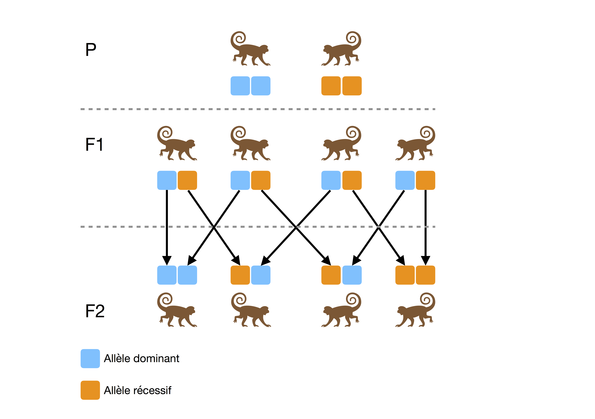

# Introduction 

## La génétique des populations

### L'évolution comme point de départ

« La génétique est la science de l'hérédité. Elle est la clé de toute la biologie, parce qu'elle explique les mécanismes qui sont responsables de la reproduction des êtres vivants, du fonctionnement et de la transmission du matériel héréditaire, des différences entre les individus, de l'évolution biologique. » 

Cette définition, donnée par Cavalli-Sforza et traduite ici de l'italien par Françoise Brun [@cavalli1994francesco], restitue également les motivations à l'origine de l'émergence du domaine de la génétique des populations, à savoir l'étude de la variabilité interindividuelle d'un point de vue évolutionniste. Pour John H. Gillespie, il s'agit de la « discipline qui fait le lien entre la génétique et l'évolution » [@gillespie2010population] : « La génétique des populations s'intéresse à l'évolution d'un point de vue génétique. Elle diffère de la biologie en ce que ses idées les plus importantes ne sont pas expérimentales ou observationnelles mais davantage théoriques. Il pourrait difficilement en être autrement. Les objets d'étude sont principalement la fréquence et la valeur sélective des génotypes dans les populations naturelles. » 

Malgré cette caractérisation, les fondements de la génétique des populations trouvent en réalité leurs origines bien avant la formalisation en 1909 par Wilhelm Johannsen du concept de gène et donc de génotype [@roll2014holist], en témoignent les travaux de Charles Darwin (1809-1882) et de Gregor Mendel (1822-1884). *L'Origine des espèces*, publié en 1859 et considéré encore à ce jour comme le texte fondateur de la théorie de l'évolution [@darwin1980origine], énonce les premiers principes de la sélection naturelle. Les travaux de Mendel, figurent quant à eux parmi les premiers à se pencher sur les mécanismes de l'hérédité d'un point de vue statistique, notamment via l'étude de phénotypes en termes de proportions et de fréquences. 

```{r mendel, fig.cap="Représentation schématique des lois de Mendel."}

```

## À l'origine de la variabilité génétique

### La théorie de l'évolution

En 1859, Darwin soutenait l'idée selon laquelle la principale force évolutive serait la sélection naturelle [@darwin1980origine]. « Je me propose de passer brièvement en revue les progrès de l’opinion relativement à l’origine des espèces. Jusque tout récemment, la plupart des naturalistes croyaient que les espèces sont des productions immuables créées séparément. De nombreux savants ont habilement soutenu cette hypothèse. Quelques autres, au contraire, ont admis que les espèces éprouvent des modifications et que les formes actuelles descendent de formes préexistantes par voie de génération régulière. »
C'est de cette manière qu'en 1920, Edmond Barbier, dans sa notice relative à la traduction française de *L'Origine des espèces* [@darwin1980origine], décide de présenter le contexte dans lequel il a été amené à effectuer ce travail de traduction. Bien qu'elle fut globalement bien accueillie par la communauté scientifique, sa théorie fut tout de même en proie à de nombreuses critiques. L'une des principales critiques émises à son encontre fut relative à la croyance de Darwin selon laquelle l'hérédité *par mélange* serait le principal mode de transmission des caractères héréditaires [@gayon1992darwin]. Or, si sélection naturelle il y a, la conservation et la transmission des caractères sélectionnés est essentielle. Si bien qu'une hérédité *par mélange* n'est pas envisageable pour soutenir la thèse de la sélection naturelle, puisque tout caractère transmis de cette façon se verrait altéré (ou dilué si l'on souhaite conserver l'idée de mélange) à chaque génération et donc éliminé après un certain temps. Cependant, sa théorie bénéficiera par la suite des travaux de Mendel qui, lors de leur redécouverte en 1902 [@bateson1913mendel], apporteront l'élément fondamental manquant à la théorie darwinienne : le principe d'hérédité *mendélienne*. Cette théorie de l'évolution néo-darwinienne, née de la conciliation de la théorie darwinienne et du principe d'hérédité de Mendel, constitue le paradigme évolutionniste tel que nous le connaissons aujourd'hui et porte le nom de *théorie synthétique de l'évolution*.

### L'évolution d'une théorie

À la théorie néo-darwinienne est souvent opposée la théorie neutraliste développée par Motoo Kimura dans son ouvrage *The neutral theory of molecular evolution* [@kimura1983neutral], bien que ces deux théories ne soient pas incompatibles. La première suggère que les mutations apparaissent à la faveur de la sélection naturelle. La seconde affirme quant à elle que l'évolution ne serait que le résultat de mutations qui surviennent de façon tout à fait aléatoire, tout en étant sélectionnées selon le même mécanisme de sélection naturelle proposé par Darwin. 

(ref:kimuravsdarwin-cap) Représentation schématique des probabilités d'occurrence pour chaque type de mutation pour la théorie sélectionniste de Darwin et pour la théorie neutraliste de Kimura [@bromham2003modern].

```{r kimuravsdarwin, fig.cap = '(ref:kimuravsdarwin-cap)'}
data.frame(theory = sort(rep(c("Darwin", "Kimura"), 3)),
           values = c(0.75, 0.0, 0.25, 0.5, 0.45, 0.05), 
           type = rep(c("Délétère", "Neutre", "Avantageuse"), 2)) %>%
  ggplot(aes(x = theory, 
             y = values, 
             fill = type)) + 
  coord_flip() +
  scale_fill_manual(name = "Mutation", 
                    values = cbbPalette[2:4]) +
  geom_bar(stat = "identity", 
           colour = "black", 
           width = 0.5) +
  theme_bw() +
  theme(axis.ticks = element_blank(),
        axis.text.x = element_blank(),
        axis.title.x = element_blank(),
        axis.title.y = element_blank())


```

Une des composantes principales de cette nouvelle théorie consiste à affirmer que les fluctuations aléatoires dans la fréquence des allèles, n'affectant que très peu ou pas du tout la valeur sélective, constituent la principale source de variabilité de l'ADN [@charlesworth2009darwin]. Une grande partie de la variation génétique observée est fonctionnellement neutre, n'occasionnant pas de changement de phénotype. 

### Sélection naturelle

### Sélection sexuelle

### Dérive génétique

La dérive génétique est un mécanisme important en génétique des populations. Les modèles statistiques 
Nous illustrons ici le principe de dérive génétique à l'aide du modèle de Wright-Fisher tel qu'il est présenté dans l'ouvrage *Population Genetics* [@gillespie2010population].

Ten simulations of random genetic drift of a single given allele with an initial frequency distribution 0.5 measured over the course of 50 generations, repeated in three reproductively synchronous populations of different sizes. In these simulations, alleles drift to loss or fixation (frequency of 0.0 or 1.0) only in the smallest population

(ref:drift-cap) Simulation numérique de la dérive génétique. La fréquence de l'allèle étudié est simulée pour 5 populations constituées chacune de 20 individus sur une période de 100 générations. Dans chaque population, la fréquence de l'allèle est initialement de 0.20.

```{r drift, fig.height=8, fig.cap='(ref:drift-cap)'}

nb_generations <- 100
nb_populations <- 5
s <- c(20, 100, 1000)
p1 <- 0.2
init <- vector(mode = "numeric", 
               length = (nb_generations + 1) * nb_populations * length(s))
af.df <- data.frame(generation = init,
                    f.obs = init,
                    population = init,
                    size = sort(rep(s, (nb_generations + 1) * nb_populations)))

for (N in s) {
  for (k in 1:nb_populations) {
    x <- rep("A2", length = 2 * N)
    idx <- sample(1:(2 * N), size = floor(2 * N * p1)) 
    x[idx] <- "A1"
    offset <- (k - 1) * (nb_generations + 1)
    af.df[af.df$size == N, ]$generation[offset + 1] <- 0
    af.df[af.df$size == N, ]$f.obs[offset + 1] <- sum(x == "A1") / (2 * N)
    af.df[af.df$size == N, ]$population[offset + 1] <- k
    
    for (i in 1:nb_generations) {
      x <- sample(x, size = 2 * N, replace = TRUE)
      af.df[af.df$size == N, ]$generation[offset + i + 1] <- i
      af.df[af.df$size == N, ]$f.obs[offset + i + 1] <- sum(x == "A1") / (2 * N)
      af.df[af.df$size == N, ]$population[offset + i + 1] <- k
    }
  }
}

af.df %>% 
  ggplot(aes(x = generation, 
             y = f.obs, 
             color = as.factor(population))) +
  facet_wrap(~size, ncol = 1) +
  geom_line(size = 1.5) +
  scale_color_manual(values = cbbPalette[2:6]) +
  ylim(0, 1) +
  xlab("Génération") +
  ylab("Fréquence allélique") +
  theme_bw() +
  theme(legend.position = "none")
```
La fréquence d'un allèle au sein d'une population est principalement impactée par deux facteurs :

- Le nombre d'individus composant la population

- Les lois de Mendel

La figure \@ref(fig:drift) met en évidence deux propriétés de la dérive génétique :

- Les fréquences alléliques évoluent de façon indépendante d'une population à une autre.

- La dérive génétique entraîne une perte de diversité allélique au sein des populations de petite taille. Dans le modèle de Wright-Fisher, les fréquences alléliques finissent éventuellement par atteindre les états dits absorbants que sont $0$ et $1$.


Wiki : "En particulier, l'hypothèse de neutralité, sous laquelle les mutations n'ont aucune influence sur la valeur sélective, est l'hypothèse nulle généralement retenue dans les travaux où une telle hypothèse est nécessaire."

La formulation d'une hypothèse ou d'un ensemble d'hypothèses permettant de décrire un processus évolutif en l'absence de sélection, portant généralement le nom de *modèle neutre*, est souvent de première nécessité dans toute démarche visant à caractériser un mécanisme de sélection. La donnée d'observations mettant en défaut le modèle neutre aura pour conséquences de créditer davantage une hypothèse invoquant un processus de sélection.

### Mutations aléatoires

Si la dérive génétique entraîne une perte de diversité allélique, les mutations favorisent quant à elle le maintien des variations génétiques entre les populations [@gillespie2010population]. Une mutation peut survenir à un locus donné avec une probabilité spécifique à chaque espèce, appelée *taux de mutation*.

```{r mutationRate}
species <- c("C. elegans", "Drosophile", "Souris", "Homme")
rates <- c("2.3E-10", "3.4E-10", "1.8E-10", "5E-11")
mr.df <- data.frame(Species = species,
                    Rates = rates)
colnames(mr.df) <- c("Espèce", "Taux de mutation")
kable(mr.df) %>% 
  kable_styling(bootstrap_options = "striped", 
                full_width = F, 
                position = "center")
```

### Flux de gène

Le flux de gène est le résultat d'évènements migratoires, initiés par des individus appartenant à une population donnée, vers une seconde population dont le pool génique diffère éventuellement de la population d'origine. 

```{r}
map_data("france") %>% 
  ggplot() + 
  geom_polygon(aes(x = long, 
                   y = lat, 
                   group = group)) + 
  coord_fixed(1.3) + 
  theme_bw()
```

## Adaptation 

### Adaptation locale


Haut plateau, Lactase [@jeong2014adaptations]

Sélection naturelle
Environnement hétérogène

## Données de séquençage nouvelle génération

### Next-Generation Sequencing (NGS)

Exome, Genome, transcriptome, etc...

Le séquençage nouvelle génération a connu un essor considérable au cours des dernières décennies. Si bien que les prouesses techniques et les progrès technologiques réalisés dans ce domaine ont permis de réduire d'un facteur 100,000 les coûts de séquençage en l'espace de seulement 15 ans [@wetterstrand2013dna].

(ref:wetterstrand) Évolution des coûts de séquençage depuis 2001 [@wetterstrand2013dna]. 

```{r wetterstrand, fig.cap='(ref:wetterstrand)'}
df <- read.csv("data/seqcost2015_4.csv")
df %>% 
  mutate(log10CpG = log10(Cost.per.Genome)) %>% 
  ggplot(aes(x = as.Date(Date), y = log10CpG)) + 
  geom_line(color = cbbPalette[2], size = 1.5) +
  geom_point(color = cbbPalette[6], size = 1.5) +
  scale_y_continuous(breaks = 1:8, 
                     labels = c("10",
                                "100",
                                "1K",
                                "10K",
                                "100K",
                                "1M",
                                "10M",
                                "100M")) +
  xlab("Année") +
  ylab("Coût par génôme (en dollars)") + 
  scale_x_date(date_minor_breaks = "1 year") +
  theme_bw()
```

Le séquençage nouvelle génération génèrant de considérables volumes de données, de nouvelles problèmatiques se posent quant à leur stockage et leur analyse, nécessitant l'utilisation de puissantes ressources de calcul ainsi que le développement d'algorithmes plus adaptés [@gogol2012overview]. Financement croissant pour l'acquisition de données NGS [@muir2016real].

###

L'accumulation de données, aussi bien en termes d'observations qu'en termes de variables, laisse à penser que le traitement de celles-ci pourrait permettre de détecter efficacement les variables qui sont responsables ou qui influencent un phénomène particulier. Cela pourrait être par exemple l'utilisation de bases de données automobiles pour prédire la durée de vie de véhicules neufs, ou encore celle de données climatiques pour estimer les variations de température auxquelles pourrait être sujette notre planète. Cette accumulation massive s'accompagne tout de même d'un phénomène bien connu en statistiques, phénomène qui porte le nom de "curse of dimensionality" [@giraud2014introduction]. 

### Les marqueurs génétiques

Au concept de génétique est souvent associé l'acronyme ADN, correspondant au nom de la molécule d'Acide désoxyribonucléique.

DNA bases pair up with each other, A with T and C with G, to form units called base pairs. Each base is also attached to a sugar molecule and a phosphate molecule. Together, a base, sugar, and phosphate are called a nucleotide. Nucleotides are arranged in two long strands that form a spiral called a double helix. The structure of the double helix is somewhat like a ladder, with the base pairs forming the ladder’s rungs and the sugar and phosphate molecules forming the vertical sidepieces of the ladder. https://ghr.nlm.nih.gov/primer/basics/dna
Chaque chromosome est constitué de deux brins d'ADN.
La structure spatiale de l'ADN n'étant pas prise en compte dans les travaux présentés ici, nous en garderons une représentation unidimensionnelle.

D'un point de vue statistique, seuls les sites nucléotidiques potentiellement variables d'une observation à une autre présentent un intérêt. Ces variations génétiques peuvent se manifester sous différentes formes, nous amenant à les classer d'autant de façons :


- Microsatellite :

Jusqu'à présent, les microsatellites ont connu un succès important, notamment grâce à la popularisation de techniques telles que la PCR (*Polymerase Chain Reaction*). Leur étude a permis de mettre en évidence l'implication de divers blablabla. Un microsatellite est repérable par la répétition successive de petits motifs chacun composé de 1 à 4 acides aminés.

(ref:microsat) Exemples de microsatellites. La première séquence comporte 3 répétitions du motif CCG, tandis que la seconde inclut 4 répétitions du motif CA.

```{r microsat, fig.cap = '(ref:microsat)'}
pair_base = function(seq) {
  x <- vector(mode = "character", length = length(seq))
  x[seq == "A"] <- "T"
  x[seq == "T"] <- "A"
  x[seq == "C"] <- "G"
  x[seq == "G"] <- "C"
  return(x)
}

N <- 20
nuclA1 <- sample(c("A", "C", "G", "T"), size = N, replace = TRUE)
nuclB1 <- sample(c("A", "C", "G", "T"), size = N, replace = TRUE)
idx.microsatA <- 3:11
idx.microsatB <- 10:17
nuclA1[idx.microsatA] <- c("C", "C", "G") 
nuclB1[idx.microsatB] <- c("C", "A")
nuclA2 <- pair_base(nuclA1)
nuclB2 <- pair_base(nuclB1)

tA <- rep("DNA", 2 * N)
tB <- rep("DNA", 2 * N)
tA[c(idx.microsatA, idx.microsatA + N)] <- "X"
tB[c(idx.microsatB, idx.microsatB + N)] <- "X"

microsatA.df <- data.frame(x1 = rep(1:N, 2),
                           x2 = rep(2:(N + 1), 2),
                           y1 = c(rep(1, N), rep(3, N)),
                           y2 = c(rep(2, N), rep(4, N)),  
                           t = tA,
                           r = c(nuclA1, nuclA2),
                           type = "3 répétitions du motif CCG")

microsatB.df <- data.frame(x1 = rep(1:N, 2),
                           x2 = rep(2:(N + 1), 2),
                           y1 = c(rep(1, N), rep(3, N)),
                           y2 = c(rep(2, N), rep(4, N)),  
                           t = tB,
                           r = c(nuclB1, nuclB2),
                           type = "4 répétitions du motif CA")

rbind(microsatA.df, microsatB.df) %>% 
  mutate(t = factor(t, 
                    levels = c("DNA", 
                               "X"), 
                    ordered = TRUE)) %>%
  ggplot() + 
  ggtitle("Microsatellite") + 
  facet_wrap(~type, ncol = 1, scales = "free_x") +
  coord_fixed(ratio = 1) +
  scale_y_continuous(limits = c(-0.5, 5.5)) +
  scale_fill_manual(values = cbbPalette[c(3, 7)]) +
  geom_rect(mapping = aes(xmin = x1, 
                          xmax = x2, 
                          ymin = y1, 
                          ymax = y2, 
                          fill = t), 
            color = "black", 
            alpha = 0.75) +
  geom_text(aes(x = x1 + (x2 - x1) / 2, 
                y = y1 + (y2 - y1) / 2, 
                label = r), 
            size = 4) +
  theme_bw() +
  theme(axis.text.x = element_blank(),
        axis.text.y = element_blank(),
        axis.ticks = element_blank(),
        axis.title.x = element_blank(),
        axis.title.y = element_blank(),
        legend.position = "none",
        plot.title = element_text(hjust = 0.5))
```


- Indel :

INDEL (INsertion/DELetion) is where a single base has been deleted, or inserted into one genome relative to another. It is a symmetrical relationship, as a deletion in one corresponds to an insertion in another. 


```{r indel}
N <- 20
nuclA1 <- sample(c("A", "C", "G", "T"), size = N, replace = TRUE)
nuclA2 <- pair_base(nuclA1)
nuclB1 <- nuclA1
nuclB2 <- nuclA2
idx.SNP <- sample(1:N, size = 1)
nuclB1[idx.SNP] <- "-"
nuclB2[idx.SNP] <- "-"
tA <- rep("DNA1", 2 * N)
tB <- rep("DNA2", 2 * N)
tA[c(idx.SNP, idx.SNP + N)] <- "X"
tB[c(idx.SNP, idx.SNP + N)] <- "X"

indelA.df <- data.frame(x1 = rep(1:N, 2),
                        x2 = rep(2:(N + 1), 2),
                        y1 = c(rep(1, N), rep(3, N)),
                        y2 = c(rep(2, N), rep(4, N)),  
                        t = tA,
                        r = c(nuclA1, nuclA2),
                        marker.type = "Indel")

indelB.df <- data.frame(x1 = rep(1:N, 2),
                        x2 = rep(2:(N + 1), 2),
                        y1 = c(rep(7, N), rep(9, N)),
                        y2 = c(rep(8, N), rep(10, N)),  
                        t = tB,
                        r = c(nuclB1, nuclB2),
                        marker.type = "Indel")

rbind(indelA.df, indelB.df) %>%
  mutate(t = factor(t, 
                    levels = c("DNA1", 
                               "DNA2", 
                               "X"), 
                    ordered = TRUE)) %>%
  ggplot() + 
  ggtitle("Insertion/Délétion") + 
  coord_fixed() +
  scale_fill_manual(values = cbbPalette[c(3, 6, 7)]) +
  geom_rect(mapping = aes(xmin = x1, 
                          xmax = x2, 
                          ymin = y1, 
                          ymax = y2, 
                          fill = t), 
            color = "black", 
            alpha = 0.75) +
  geom_text(aes(x = x1 + (x2 - x1) / 2, 
                y = y1 + (y2 - y1) / 2, 
                label = r), 
            size = 4) +
  theme_bw() +
  theme(axis.text.x = element_blank(),
        axis.text.y = element_blank(),
        axis.ticks = element_blank(),
        axis.title.x = element_blank(),
        axis.title.y = element_blank(),
        legend.position = "none",
        plot.title = element_text(hjust = 0.5))
```

- Polymorphisme nucléotidique : 

```{r snp}
N <- 20
nuclA1 <- sample(c("A", "C", "G", "T"), size = N, replace = TRUE)
nuclA2 <- pair_base(nuclA1)
nuclB1 <- nuclA1
idx.SNP <- sample(1:N, size = 1)
if (nuclA1[idx.SNP] == "A" || nuclA1[idx.SNP] == "T") {
  nuclB1[idx.SNP] <- sample(c("C", "G"), size = 1)
} else if (nuclA1[idx.SNP] == "C" || nuclA1[idx.SNP] == "G") {
  nuclB1[idx.SNP] <- sample(c("A", "T"), size = 1)
} 
nuclB2 <- pair_base(nuclB1)

tA <- rep("DNA1", 2 * N)
tB <- rep("DNA2", 2 * N)
tA[c(idx.SNP, idx.SNP + N)] <- "X"
tB[c(idx.SNP, idx.SNP + N)] <- "X"

SNPA.df <- data.frame(x1 = rep(1:N, 2),
                      x2 = rep(2:(N + 1), 2),
                      y1 = c(rep(1, N), rep(3, N)),
                      y2 = c(rep(2, N), rep(4, N)),  
                      t = tA,
                      r = c(nuclA1, nuclA2),
                      marker.type = "SNP")

SNPB.df <- data.frame(x1 = rep(1:N, 2),
                      x2 = rep(2:(N + 1), 2),
                      y1 = c(rep(7, N), rep(9, N)),
                      y2 = c(rep(8, N), rep(10, N)),  
                      t = tB,
                      r = c(nuclB1, nuclB2),
                      marker.type = "SNP")

rbind(SNPA.df, SNPB.df) %>% 
  mutate(t = factor(t, 
                    levels = c("DNA1", 
                               "DNA2", 
                               "X"), 
                    ordered = TRUE)) %>%
  ggplot() + 
  ggtitle("Polymorphisme nucléotidique") + 
  coord_fixed() +
  scale_fill_manual(values = cbbPalette[c(3, 6, 7)]) +
  geom_rect(mapping = aes(xmin = x1, 
                          xmax = x2, 
                          ymin = y1, 
                          ymax = y2, 
                          fill = t), 
            color = "black", 
            alpha = 0.75) +
  geom_text(aes(x = x1 + (x2 - x1) / 2, 
                y = y1 + (y2 - y1) / 2, 
                label = r), 
            size = 4) +
  theme_bw() +
  theme(axis.text.x = element_blank(),
        axis.text.y = element_blank(),
        axis.ticks = element_blank(),
        axis.title.x = element_blank(),
        axis.title.y = element_blank(),
        legend.position = "none",
        plot.title = element_text(hjust = 0.5))

```


