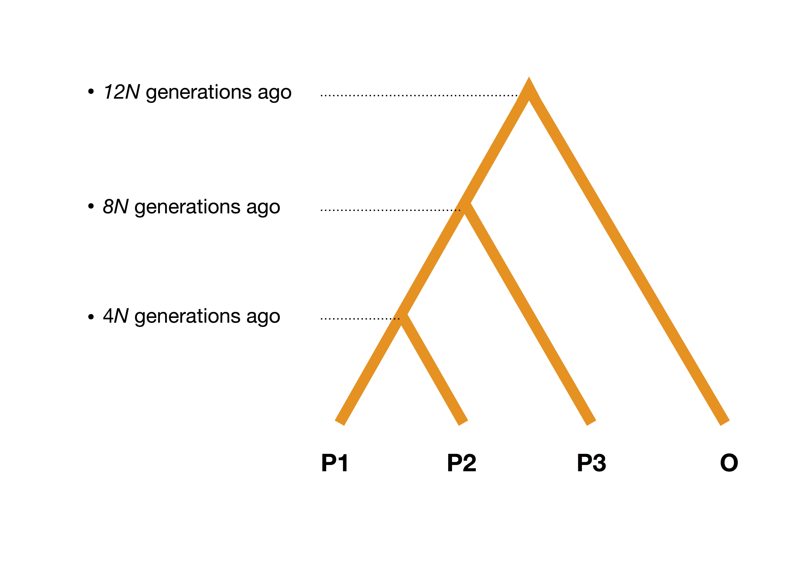
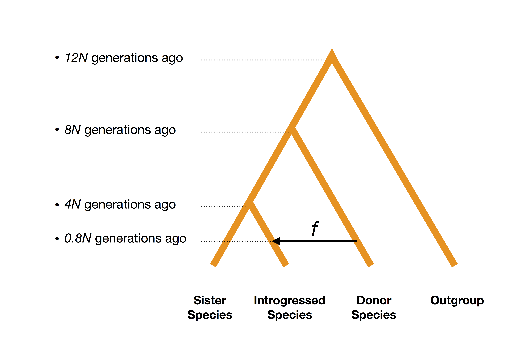

# Introgression adaptative

## Qu'est-ce que l'introgression ?

Avant de s'intéresser à la notion d'introgression, intéressons-nous d'abord à celle d'hybridation. L'hybridation peut être définie comme la reproduction entre deux individus appartenant à deux espèces ou à deux populations différentes. Cette définition nous amène à nous poser deux questions. La première, relative à la notion d'espèce, est souvent sujette à controverse. La seconde concerne quant à elle la désignation de populations différentes. Qu'est-ce qui fait que deux groupes d'individus sont différents ? Harrison suggère en 1990 que deux individus issus de populations différentes doivent chacun posséder des traits héritables qui les différencient [@harrison1990hybrid]. 

Nous parlons d'introgression lorsqu'un certain nombre de gènes est transféré d'une population à une autre.

L'étude de régions génomiques présentant des caractéristiques d'introgression ou de divergence peut se révéler intéressante pour plusieurs raisons. 


## Coefficients de métissage globaux et locaux

Étant données des populations ancestrales, il est possible d'estimer pour un individu donné, la proportion de son génôme provenant de chacune des populations ancestrales. Ces proportions sont connues plus communément sous le nom de *coefficients de métissage globaux*. De nombreux logiciels existent pour l'estimation de ces coefficients : STRUCTURE, ADMIXTURE [@alexander2009fast], LEA [@frichot2015lea], tess3r [@caye2016tess3]. En complément à cette information globale, il peut être intéressant de déterminer sur des portions plus petites du génôme, de la même manière que dans le cas global, les proportions venant de telle ou telle population ancestrale pour chacune de ces portions. Nous parlons dans ce cas de *coefficients de métissage locaux*. Encore une fois, plusieurs logiciels ont été proposés dans le but d'estimer ces coefficients : Hapmix [@price2009sensitive], EILA [@yang2013efficient], LAMP [@thornton2014local], loter ou encore RFmix [@maples2013rfmix].

## Introgression

L'introgression peut être détectée de différentes façons. Une première approche consiste à utiliser les *coefficients de métissage locaux*. Les méthodes mentionnées plus haut estiment ces coefficients pour chaque individu, permettant de calculer à partir de ceux-ci des coefficients de métissage locaux pour chaque population.

## Lien entre Analyse en Composantes Principales et métissage global.

L'un des premiers articles à établir un lien entre l'ACP et les coefficients de métissage global fut sur l'interprétation généalogique de l'ACP de Gil McVean [@mcvean2009genealogical]: 

(ref:mcvean-cap) Coefficients de métissage et ACP [@mcvean2009genealogical].

```{r mcvean, results = 'asis', fig.cap = '(ref:mcvean-cap)', out.width = '300px'}
include_graphics("figure/mcvean.png")
```

Pour chacun des 22 chromosomes, 

## Analyse en Composantes Principales locale

Notant $p$ le nombre de marqueurs génétiques, $i$ un entier compris entre $1$ et $p$, et $x_i$ la position génétique (en Morgans) ou la position physique (en paires de bases) du $i$-ème marqueur génétique. Nous définissons pour cet entier $i$ la fenêtre $W_i^T$ de taille $T$ et centrée en $i$ :

$$W_i^T = \{ j \in [|1, p|], |x_i - x_j| \leq T/2 \}$$

## Sensibilité à l'imputation des données manquantes

\newpage

### Méthodes de détection

#### Etat de l'art

##### Scénario à flux de gènes

###### La statistique D de Patterson

La statistique $D$ de Patterson [@durand2011testing] demeure aujourd'hui la méthode la plus utilisée pour détecter la trace de flux de gènes dans une population. La méthode repose sur l'observation de motifs portant les noms *ABBA* et *BABA*, en référence aux différents types de généalogie possible pour un site nucléotidique.

$$ D = \displaystyle \frac{\sum_i C_{ABBA}(i) - C_{BABA}(i)}{\sum_i C_{ABBA}(i) + C_{BABA}(i)} $$

###### RNDmin

[Descriptif de RNDmin]

Pour comprendre la récente méthode proposée par [@rosenzweig2016powerful], il est nécessaire de définir un certain nombre de statistiques dont $RND_{\text{min}}$ dérive.

&nbsp;

- $d_{xy}$ est la distance de Hamming entre la séquence $X$ de la population $1$ et la séquence $Y$ de la population $2$. Ainsi, si $x = (x_i)_{1 \leq i \leq n}$ et $y = (y_i)_{1 \leq i \leq n}$, alors : 

$$d_{xy} = \text{Card}(\{i \in [|1, n|] \; | \; x_i \neq y_i \})$$

Cette statistique est ainsi définie pour une paire de séquences ($x$, $y$). Pour quantifier la dissimilarité entre deux ensembles de séquences, deux approches sont possibles. La première consiste à calculer la distance moyenne $d_{XY}$. De par sa définition, cette distance présente néanmoins le défaut d'être peu sensible aux épisodes récents d'introgression [@geneva2015new].
En effet, les faibles valeurs de $d_{xy}$ correspondant à des évènements de divergence récents peuvent voir leur influence diminuée en cas de présence d'évènements de divergence plus anciens.
Pour pallier à ce problème, considérer la distance minimale entre les deux ensembles de séquences [@joly2009statistical] constitue une solution intéressante.

[Expliquer pourquoi on définit $d_{\text{out}}$ et $RND$]

En définissant $d_{out} = \frac{1}{2}(d_{XO} + d_{YO})$, il est possible de définir de la même 
façon $RND_{min}$ :

$$RND_{\text{min}} = \frac{d_{\text{min}}}{d_{\text{out}}}$$

Pour récapituler, $RND_{\text{min}}$ est une statistique robuste aux variations de taux de mutation et qui reste sensible aux récents évènements d'introgression. En pratique, l'introduction de $d_{\text{out}}$ requiert ainsi la donnée d'une population ancestrale commune aux deux populations d'intérêt.

###### Bdf

##### Analyse Linéaire Discriminante

#### Régression linéaire, régression logistique, forêts aléatoires et importance des variables

#### Régression locale, package mgcv, locfit, Backward selection strategy

#### ACP locale et espace de formes

\newpage


## Simulations

### Données de peupliers

Le premier jeu de données est issu d'une étude d'introgression adaptative chez les peupliers d'Amérique du Nord [@suarez2016]. La simulation d'haplotypes d'individus admixés est effectuée à partir des deux populations ancestrales qui y sont présentes. La première, *Populus Balsamifera*, est une espèce de peupliers qui peuple le nord du continent nord-américain, d'Est en Ouest, et se trouve exposée à des conditions climatiques peu clémentes.La seconde, *Populus Trichocarpa*, est principalement localisée en Californie, et bénéficie d'un climat continental.

Chacune des simulations est constituée de $50$ haplotypes de la souche continentale, de $50$ haplotyêpes de la souche boréale, ainsi que de $50$ haplotypes d'individus hybrides générés à partir des haplotypes ancestraux. Ces haplotypes ancestraux ont été estimés à l'aide du logiciel Beagle. A partir des positions en paires de base, une carte de recombinaison génétique est générée en utilisant le taux de recombinaison moyen chez le peuplier. Le taux de recombinaison, noté $\tau_r$, correspond au nombre moyen de paires de bases à parcourir pour qu'ait lieu un épisode de recombinaison génétique, *i.e.*, notant $L$ la longueur du chromosome en Morgans ($M$), et $N_{bp}$ le nombre de paires de bases le constituant, le taux de recombinaison génétique pour ce chromosome est donné par la relation:

$$\tau_r = \frac{L}{N_{bp}}$$ 

Dans ce scénario, les simulations ont été produites en utilisant un taux de recombinaison génétique moyen $\tau_r$ de $0.05$ centiMorgans par million de paire de bases, correspondant à la valeur utilisée par les auteurs de l'étude avec le logiciel RASPberry (\textit{Recombination via Ancestry Switch Probability}). A partir de la donnée de la position physique en paires de bases ainsi que du taux de recombinaison moyen, nous générons une carte de recombinaison génétique adaptée à nos simulations.

### Génération aléatoire d'individus hybrides

Pour simuler un individu métissé, il est d'abord nécessaire de simuler l'emplacement des évènements de recombinaison. Pour ce faire, nous utilisons le modèle décrit dans [@price2009sensitive], en parcourant


```{r lambda0001, echo = FALSE, out.width = "400px", out.height="200px", fig.align = 'center', fig.cap="$\\lambda = 0.001$"}
include_graphics(path = "figure/ancestry_heatmap_lambda_0001.png")
```
```{r lambda001, echo = FALSE, out.width = "400px", out.height="200px", fig.align = 'center', fig.cap="$\\lambda = 0.01$"}
include_graphics(path = "figure/ancestry_heatmap_lambda_001.png")
```
```{r lambda01, echo = FALSE, out.width = "400px", out.height="200px", fig.align = 'center', fig.cap="$\\lambda = 0.1$"}
include_graphics(path = "figure/ancestry_heatmap_lambda_01.png")
```


```{r simulations, eval = FALSE}
path <- "~/Documents/thesis/git/simulations/introgression/"
output.name <- "populus"
recombinationRate <- 0.05 # in Morgans per Megabase
nSNP <- 50000
ancstrl.1 <- 1
ancstrl.2 <- 3
hyb <- 4
intro.size <- 500
global.ancestry <- 0.1
inverted.ancestry <- 0.5

info.map <- as.matrix(fread(paste0(path, output.name, ".map"), 
                            data.table = FALSE))
H1 <- as.matrix(fread(paste0(path, output.name, "_H1"), 
                      data.table = FALSE))
H2 <- as.matrix(fread(paste0(path, output.name, "_H2"), 
                      data.table = FALSE))
n.hyb <- ncol(H1) / 2 

### Introgression region
idx <- sample(1:nSNP, size = 1)
beg.reg <- max(1, idx - intro.size)
end.reg <- min(nSNP, idx + intro.size)
intro.reg <- beg.reg:end.reg
```

\newpage


```{r, eval = FALSE, echo = FALSE, fig.width = 7, fig.height = 4, fig.align = 'center', fig.cap = "$\\lambda = 0.1$"}
lambda <- 0.1
res <- simulate::generate_hybrid_matrix(H1, 
                                        H2, 
                                        alpha = global.ancestry, 
                                        beta = inverted.ancestry, 
                                        n.hyb = n.hyb,
                                        gen_map = info.map[, 2], 
                                        lambda = lambda, 
                                        ancestry.switch = intro.reg)
simulate::display.ancestry(res$true.ancestry.matrix)
im <- matrix(0, ncol = ncol(res$true.ancestry.matrix), nrow = nrow(res$true.ancestry.matrix))
im[res$true.ancestry.matrix == "22"] <- 2
im[res$true.ancestry.matrix %in% c("12", "21")] <- 1
im[res$true.ancestry.matrix == "11"] <- 0
image(im, axes = FALSE, xlab = "", ylab = "")
```

```{r, eval = FALSE, echo = FALSE, fig.width = 7, fig.height = 4, fig.align = 'center', fig.cap = "$\\lambda = 10$"}
lambda <- 10
res <- simulate::generate_hybrid_matrix(H1, 
                                        H2, 
                                        alpha = global.ancestry, 
                                        beta = inverted.ancestry, 
                                        n.hyb = n.hyb,
                                        gen_map = info.map[, 2], 
                                        lambda = lambda, 
                                        ancestry.switch = intro.reg)
simulate::display.ancestry(res$true.ancestry.matrix)
im <- matrix(0, ncol = ncol(res$true.ancestry.matrix), nrow = nrow(res$true.ancestry.matrix))
im[res$true.ancestry.matrix == "22"] <- 2
im[res$true.ancestry.matrix %in% c("12", "21")] <- 1
im[res$true.ancestry.matrix == "11"] <- 0
image(im, axes = FALSE, xlab = "", ylab = "")
```


```{r, eval = FALSE, echo = FALSE, fig.width = 7, fig.height = 4, fig.align = 'center', fig.cap = "$\\lambda = 50$"}
lambda <- 50
res <- simulate::generate_hybrid_matrix(H1, 
                                        H2, 
                                        alpha = global.ancestry, 
                                        beta = inverted.ancestry, 
                                        n.hyb = n.hyb,
                                        gen_map = info.map[, 2], 
                                        lambda = lambda, 
                                        ancestry.switch = intro.reg)
simulate::display.ancestry(res$true.ancestry.matrix)
im <- matrix(0, ncol = ncol(res$true.ancestry.matrix), nrow = nrow(res$true.ancestry.matrix))
im[res$true.ancestry.matrix == "22"] <- 2
im[res$true.ancestry.matrix %in% c("12", "21")] <- 1
im[res$true.ancestry.matrix == "11"] <- 0
image(im, axes = FALSE, xlab = "", ylab = "")
```


### Simulations à partir de ms et Seq-Gen

Dans le scénario d'introgression via flux de gènes, nous nous inspirons des modèles de simulation décrits dans [@martin2014evaluating]. Ces modèles sont largement repris dans la littérature pour l'évaluation de statistiques telles que $RND_{min}$ [@rosenzweig2016powerful] et $Bd_f$ [@pfeifer2017estimates]. Chaque simulation est constituée de 100 individus. Un individu est généré en concaténant un certain nombre de séquences de nucléotides, d'une longueur fixée à 5000 paires de bases par séquence. Chacune de ces séquences est elle-même simulée suivant un modèle neutre ou alternatif. Le modèle neutre décrit un scénario démographique classique de populations divergentes. Le modèle alternatif décrit quant à lui un scénario légèrement différent, et servira à caractériser les séquences *introgressées*. Les lignes de commande *ms* permettant de générer les séquences de nucléotides pour le modèle neutre ainsi que pour le modèle alternatif sont données ci-dessous : 

&nbsp;

- Modèle neutre :

```
./ms 200 1 -I 4 50 50 50 50 -ej 1 2 1 -ej 2 3 1 -ej 3 4 1 
-r 50 5000 -T 
```

```{r background, results="asis", echo=FALSE, out.extra="scale=0.5", fig.align = 'center', fig.cap="Modèle neutre. $12N$ genérations auparavant, premier épisode de divergence donnant naissance à P1 et à O. $8N$ générations auparavant, deuxième épisode de divergence voyant l'apparition de P3. $4N$ générations auparavant, dernier épisode de divergence et apparition de P2."}

```

&nbsp;

- Modèle alternatif :

```
./ms 200 1 -I 4 50 50 50 50 -ej 1 2 1 -ej 2 3 1 -ej 3 4 1 
-es 0.1 2 0.8 -ej 0.1 5 3 -r 50 5000 -T
```

```{r alternate, results="asis", echo=FALSE, out.extra="scale=0.5", fig.align = 'center', fig.cap="Modèle alternatif. $12N$ genérations auparavant, premier épisode de divergence donnant naissance à P1 et à O. $8N$ générations auparavant, deuxième épisode de divergence voyant l'apparition de P3. $4N$ générations auparavant, dernier épisode de divergence et apparition de P2. $t$ unités de temps auparavant, épisode de flux de gènes de P3 vers la population P2."}

```

La variable $f$ présente en figure \@ref(fig:alternate) représente le taux d'introgression, elle quantifie la proportion d'haplotypes présents dans la population P2 et qui proviennent de la population P3. Ainsi, une valeur de $f$ égale à $1$ reviendrait à simuler un épisode de divergence de la population P3, duquel découlerait la naissance de la population P2. La valeur de $f$ utilisée ci-dessus est $0.2$, signifiant que 20% des haplotypes présents dans la population 2 sont issus de la population P3.

### Résultats de la comparaison des logiciels

```{r}
im.df <- data.frame(methods = c("Bdf", "D", "f_d", "pcadapt", "RNDmin"),
                    input = c("genoytpes", "genoytpes", "genoytpes", "genoytpes", "haplotypes"),
                    nb_of_pop = c("4", "4", "4", ">= 3", "3"),
                    outgroup = c("Oui", "Oui", "Oui", "Oui", "Oui"))

knitr::kable(im.df, 
             col.names = c("Statistique", 
                           "Format",
                           "Nombre de populations", 
                           "Dont Outgroup"), 
             format = "latex")
```

##### Scénario de métissage

Nous comparons ici notre méthode au logiciel RFMix destiné à la détermination de coefficients de métissage local. 

```{r ras10g, results="asis", echo=FALSE, fig.cap="10 generations", out.width="500px"}
include_graphics("figure/facet_admixture_setting_10_gen.pdf")
```

```{r ras100g, results="asis", echo=FALSE, fig.cap="100 generations", out.width="500px"}
include_graphics("figure/facet_admixture_setting_100_gen.pdf")
```

```{r ras1000g, results="asis", echo=FALSE, fig.cap="1000 generations", out.width="500px"}
include_graphics("figure/facet_admixture_setting_1000_gen.pdf")
```


##### Scénario à flux de gènes

Dans ce paragraphe, nous comparons notre statistique de test à un ensemble de statistiques implémentées dans le package R *PopGenome* : la statistique $D$ de Patterson, RNDmin [@rosenzweig2016powerful] et BDF [@pfeifer2017estimates].

\newpage

## Article 3 

### Introduction {-}

A potential source of adaptive genetic variation is adaptive introgression. Adaptive introgression occurs when selectively beneficial alleles are transferred between species [@arnold2009adaptation; @dasmahapatra2012butterfly; @fraisse2014gene]. Although adaptive genetic variation originates primarily from de novo mutation or standing variation, adaptive introgression is now acknowledged as an important source of genetic variation in plants but also in animals [@hedrick2013adaptive].

To model adaptive introgression, there are at least two conceptual evolutionary scenario. In the first "admixture" scenario, two populations or two related species  admixed to form a new hybrid population (Figure \@ref(fig:scenarios)). Adaptive introgression occurs when variation from one of the source population is adaptive in the environment of the admixed population. For instance, Tibetans are the results of admixture between Han and Sherpa populations, and alleles that confer adaptation to high altitude have been transmitted by the Sherpa population [@jeong2014admixture]. Evidence of adaptive introgression following admixture has been provided in several admixed populations or species, including Africanized honeybee, Populus species, North American canids, or human Bantu-speaking populations to name just a few examples [@payseur2016genomic; @suarez2016; @vonholdt2016admixture; @patin2017dispersals; @nelson2017genome]. The second evolutionary scenario assumes "gene flow" or "introgression" from a donor species to an introgressed species (Figure \@ref(fig:scenarios)). For instance, house mice became resistant to a warfarin pesticide because of selection on VKORC1 polymorphisms that has been acquired from the Algerian mouse (*M. spretus*) through introgression [@song2011adaptive]. Another classical example of introgression followed by adaption include colour adaptations in Heliconius species [@pardo2012adaptive]. Whereas detection of loci involved in adaptive introgression are performed with different statistical methods for the admixture and gene flow evolutionary models, we propose a statistical approach that is valid in both evolutionary models. 

In the admixture model, outlier loci are found by looking for genomic regions harboring excess of ancestry from the donor population [@buerkle2008admixture]. Excess of ancestry are obtained using local ancestry inference (LAI) that computes for admixed individuals the number of chromosome copies coming from the ancestral populations. There are several software available for LAI including EILA, HAPMIX, LAMP-LD, or RFMIX [@baran2012fast; @jeong2014admixture; @maples2013rfmix; @price2009sensitive]. Except for EILA, LAI software can require biological information that can be difficult to obtain especially for non-model species. For instance, HAPMIX or RFMIX require phased haplotypes for the ancestral populations and RFMIX also require phased haplotypes for the admixed individuals. In addition, a recombination map and an estimate of the admixture date between the ancestral populations should be provided for both HAPMIX and RFMIX [@baran2012fast; @jeong2014admixture; @maples2013rfmix; @price2009sensitive]. 

In the "gene flow" or "introgression" scenario, there have also been attempts to find introgressed regions with outlier detection methods [@rheindt2013introgression; @smith2013heliconius; @zhang2016genome]. A common approachis to test for an excess of shared derived variants in the donor and recipient populations using the $D$ or ABBA-ABBA test statistic [@durand2011testing]. However, extreme $D$ values occur disproportionately in genomic regions with lower diversity [@martin2014evaluating].  Because genome scans with the $D$ statistic generates too many false positives, more powerful statistics have been developed such as the $f_D$ or $BDF$ statistic [@martin2014evaluating; @pfeifer2017estimates]. In addition, the $D$ statistic and its extensions cannot be used to identify introgressed regions between sister species (see Figure x panel B); it should be used with three or more lineages to detect the different topologies produced by hybridization [@rosenzweig2016powerful]. To identify introgression between sister species, various alternative statistics have been developed including $RND_{min}$, which computes the minimum pairwise distance between the two sister species relative to the divergence to an outgroup. By contrast, to the $D$ statistic and its extension, $RND_{min}$ requires phased data [@rosenzweig2016powerful].

We propose a statistical method to detect candidates for adaptive introgression that is valid in both the admixture scenario and the introgression scenarios. The proposed approach is based on principal component analysis (PCA), which is well-suited to ascertain population structure of large scale  genome-wide dataset [@patterson2006population; @mcvean2009genealogical]. Numerical solutions to compute principal component scores can be obtained rapidly even with large scale data [@duforet2015detecting; @galinsky2016fast; @abraham2017flashpca2]. The proposed approach does not require any biological information in addition to the genome-wide genotype data and should therefore be valuable especially for non-model species where recombination map are not available and where haplotype phasing can be a daunting task. The statistical method we propose ascertains population structure locally in the genome by computing local principal components. Candidate SNPs for local introgression correspond to genomic regions for which population structure of the admixed or introgressed population deviates significantly from genome-wide population structure (Figure \@ref(fig:scenarios)). To capture population structure of the admixed or introgressed individuals with respect to the other individuals, the method computes an average ancestry coefficient. In the following, we investigate to what extent the PCA-based approach provides an alternative to LAI and to the aforementioned phylogenetic statistics in the admixture and introgression scenario. We show the potential of the method to detect adaptive introgression in a hybrid *Populus* species resulting from a 2-way admixture model [@suarez2016] TO COMPLETE. The PCA-based method is implemented in the R package pcadapt [@luu2017pcadapt].

### Materials and methods {-}

#### A PCA-based approach to detect local introgression {-}

The objective of PCA is to find a new set of orthogonal variables called the principal components, which are linear combinations of (centered and standardized) allele counts, such that the projections of the data onto these axes lead to an optimal summary of the data. To present the method, we introduce the truncated singular value decomposition (SVD) that approximates the $(n \times p)$ centered and scaled genotype matrix ${\bf Y}$ by a matrix of smaller rank

\begin{equation}
  {\bf Y}\approx{\bf U}{\bf \Sigma} {\bf V}^T,
  (\#eq:svd-intro)
\end{equation}

where ${\bf U}$ is a $(n \times K)$ orthonormal matrix, ${\bf V}$ is a $(p \times K)$ orthonormal matrix, ${\bf \Sigma}$ is a diagonal $(K \times K)$ matrix and $K$ corresponds to the rank of the approximation. The solution of PCA with $K$ components can be obtained using the truncated SVD of equation \@ref(eq:svd-intro): the $K$ columns of ${\bf V}$ contain the loadings, which correspond to the contribution of each SNP to the PCs and the $K$ columns of ${\bf U}$ contain the PC *scores* that are usually displayed to visualize population structure [@patterson2006population; @duforet2015detecting].

To provide local measure of population structure, we compute local PCA scores. For a SNP $j$, we compute the vector of *local scores* ${\bf U_j}$ that measures population structure locally in the genome

\begin{equation}
  {\bf U}_j = {\bf Y_j}{\bf V_j}{\bf \Sigma}^{-1},
  (\#eq:local-scores)
\end{equation}

where ${\bf Y_j}$ correspond to the genotype restrained to a genomic window around SNP $j$ and ${\bf V_j}$ corresponds to the loadings restrained to a genomic window around SNP $j$. RAJOUTER CALCUL ONLINE DES SCORES.

An average local ancestry coefficient $q$ is then obtained from the local scores ${\bf U}_j$ using barycentric coordinates for the barycenter $B$ of the local scores of admixed or introgressed individuals. Barycentric coordinates of $B$ correspond to the $K$ coefficients $q_1,\dots,q_K$ ($q_1+\dots+q_K=1$) such as $B$ can be written as a linear combination $B = q_1 B_1 + \dots + q_K B_K$ where $B_1, \dots, B_K$ are the barycenters of local scores for the $K$ source populations. In the admixture scenario, barycentric coordinates are always between 0 and 1 because local scores of admixed individuals are always contained in the simplex determined by the barycenters of the ancestral populations (Figure \@ref(fig:admixture)). By contrasts, barycentric coordinates can be negative or larger than 1 for the introgression scenario (\ref(fig:introgression)). To find outlier regions with excess of ancestry from the donor population $j$ that is one of the $K$ source populations, we compute robust mean $\mu_j$ and variance $\sigma^2_j$ of the average ancestry coefficients using the median absolute deviation and we consider the standardized average ancestry coefficient $(q_j - \mu_j) / \sigma_j$, $j = 1, \dots, K$.

#### Parameter settings for local ancestry and adaptive introgression software {-}

For the admixture scenario, we consider three software of local ancestry inference, which are EILA, Loter and RFMix [@maples2013rfmix; @yang2013efficient]. EILA considers genotypes as input and we consider a regularization parameter of $\lambda=0.1$. Loter uses haplotypes as input data and has no tuning parameter. RFMix uses haplotypes as input data and we consider the default parameter except the window size that was set at 0.002cm. Using the default window size generates error message and as recommended by the manual of RFMix, we reduce window size to overcome this issue. When analyzing Populus data, we consider the same averaging strategy as implemented in the initial analysis with RASPberry and average local ancestry coefficients obtained with RFMix and loter using 250kb windows [@suarez2016]. 

For the introgression scenario, we compared pcadapt to the $Bd_f$, $D$, $f_D$, and $RND_{min}$ test statistics [@durand2011testing; @martin2014evaluating; @pfeifer2017estimates; rosenzweig2016powerful]. The $D$, $Bd_f$ and $f_D$ statistics require genotype data for the three related species as well as from an outgroup species, for which we also simulate genotypes (\ref{tab:stats_introgression}). Because $RND_{min}$ tests for  introgression between sister species, we provide sequence (haplotype) data from 3 species, which are the introgressed, and donor species as well as  an outgroup species (Figure \ref{fig:scenarios}). When using pcadapt, we provide genotype data from three species, which are introgressed, donor and sister species (Figure \ref{fig:scenarios}).

#### Simulations under an admixture scenario {-}

We consider the example of admixture of two {\it Populus} species in North America to simulate admixed individuals \cite[]{suarez}. We considered genotypes from chromosome 6 of $25$ individuals from the species {\it Populus balsamifera} (balsam poplar) and $25$ individuals from the species {\it Populus trichocarpa} (black cottonwood) \cite[]{suarez}. In order to generate admixed individuals, we phase the 50 genotypes using BEAGLE \cite[]{browning}. To construct admixed genomes, we began at the first marker on each chromosome and sampled {\it Populus balsamifera} ancestry with probability $\alpha=70\%$ and {\it Populus trichocarpa} ancestry with probability $(1-\alpha)=30\%$. Haplotype of the admixed genome was form by sampling at random one of the haplotype coming from the {\it P. balsamifera} or {\it P. trichocarpa} species. Ancestry was resampled based on an exponential distribution with weight $\lambda$, which corresponds to the number of generations since admixture \cite[]{price}. A new ancestry tract was sampled with probability $1-e^{-\lambda g}$ when traversing a genetic distance of $g$ Morgans.  Each time ancestry was resampled, we sampled  {\it P. balsamifera} ancestry with probability $\alpha=70\%$ and {\it P. trichocarpa} ancestry with probability $(1-\alpha)=30\%$. In the simulations, we consider the first $100,000$ SNPs of the chromosome 6 of Populus individuals. To model adaptive introgression, we assume that there is a region containing $1,000$ SNPs where  {\it P. balsamifera} ancestry was equal to $70\%-\Delta_q$ instead of $70\%$. We consider different values for $\Delta_q$ which are equal to $5\%$, $10\%$, $15\%$, $20\%$, $30\%$, $40\%$, or $50\%$. Simulations correspond to a model of soft sweep where different alleles of {\it P. balsamifera} ancestry, which span the $500$ SNPs genomic regions, are adaptive  \cite[]{messer}. Because there is no recombination map available in {\it Populus}, we assume a constant recombination rate of $0.05$ cM/Mbp \cite[]{suarez}. We consider three different values  for the time since admixture $\lambda$, which is equal to $10$, $100$, or $1000$ generations. For each value of $\lambda$ and of $\Delta_q$, we generate $50$ replicates containing $25$ admixed individuals each. When looking for adaptive introgression in admixed {\it P. trichocarpa} individuals, we consider $1,418,814$ SNPs typed in $36$ admixed individuals \cite[]{suarez}. 

#### Simulations under an introgression scenario {-}

We consider simulations of introgression as described by \cite{martin}. To simulate genomes, we concatenate 45 $5,000$ bp regions without introgression and  5 $5,000$ bp regions where each individuals from the introgressed species is drawn from the donor population with a probability $f$ (Supplementary Figure \ref{fig:introgression}). The parameter $f$ measures the extent of introgression for introgressed regions. When $f=1$ all individuals from the introgressed species come from the donor population and $f=0$ correspond to the genomic windows without introgression. The ms command lines for simulating neutral and introgressed ($f=20\%$) regions for $25$ individuals in each population are given as follows \cite[]{hudson}

```
./ms 200 1 -I 4 50 50 50 50 -ej 1 2 1 -ej 2 3 1 -ej 3 4 1-r 50 5000 -T #non-introgressed

./ms 200 1 -I 4 50 50 50 50 -ej 1 2 1 -ej 2 3 1 -ej 3 4 1 -es 0.2 2 0.8
-ej 0.2 5 3 -r 50 5000 -T #introgressed
```

Sequence data were then generated using the software Seq-Gen using the Hasegawa-Kishino-Yano substitution model and a branch scaling factor of 0.01 ( `./seq-gen -mHKY -l 5000 -s 0.01`) \cite[]{rambaut}.

